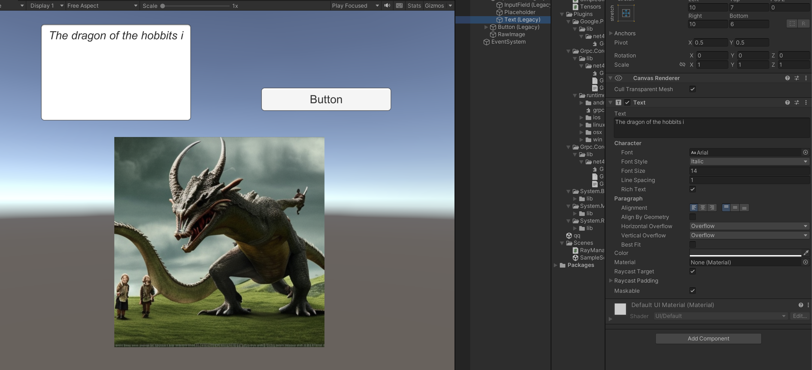

# 文字转图片(stable-diffusion) 

一.在 macOS 上构建 proto 文件的过程如下
1.brew install protobuf
2.brew tap grpc/grpc
3.brew install grpc、

二.从stability-sdk 仓库中获取generation.proto。
1.地址https://github.com/Stability-AI/api-interfaces/blob/main/src/proto/generation.proto

命令

protoc -I . --csharp_out=. --grpc_out=. --plugin=protoc-gen-grpc=/usr/local/bin/grpc_csharp_plugin tensors.proto

protoc -I . --csharp_out=. --grpc_out=. --plugin=protoc-gen-grpc=/usr/local/bin/grpc_csharp_plugin generation.proto

最后修改 Key 跟密钥 

[参考链接]<https://note.com/npaka/n/n9fd75af752d3>

