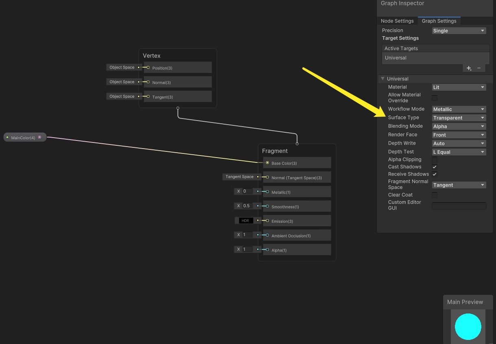

# Unity ShaderGraph实现外描边透明效果<Badge text="菲尼尔反射实现"/>
## 首先是URP环境下新建一个Lit Shader Graph

+ 新建一个MainColor的颜色变量与我们的Base Color连接
+ 选择Graph Inspector面板中的GraphSetting中Surface Type选择透明Transparent

## 接下来就是我们的菲尼尔反射的Node

+ 首先，这些反射仅出现在球体的边缘周围（即当其表面处于掠射角时），其次，随着材质的光滑度上升，这些反射变得更加明显和清晰。
+ 在标准着色器中，不能直接控制菲涅耳效应。实际上，它是通过材质的光滑度间接控制的。光滑的表面将呈现出更强的菲涅耳效应，而完全粗糙的表面将没有菲涅耳效应。

+ ShaderGraph中Node中已经封装过Fresnel Effect我们只需要Create该Node就行如下：

+ 接下来我们需要创建两个变量一个Fresnel Power控制菲尼尔反射的强度另一个控制Fresnel反射Color与Fresnel效果Out的Color相乘给予我们自发光就完成了菲尼尔的反射效果Node如下：

+ 最后我们总体调整一下透明度的问题需要用到Add Node函数如下：

+ 更改对应Shader生成的材质球参数调整一下你想要的颜色及强度吧这是我需要的外描边透明效果：

