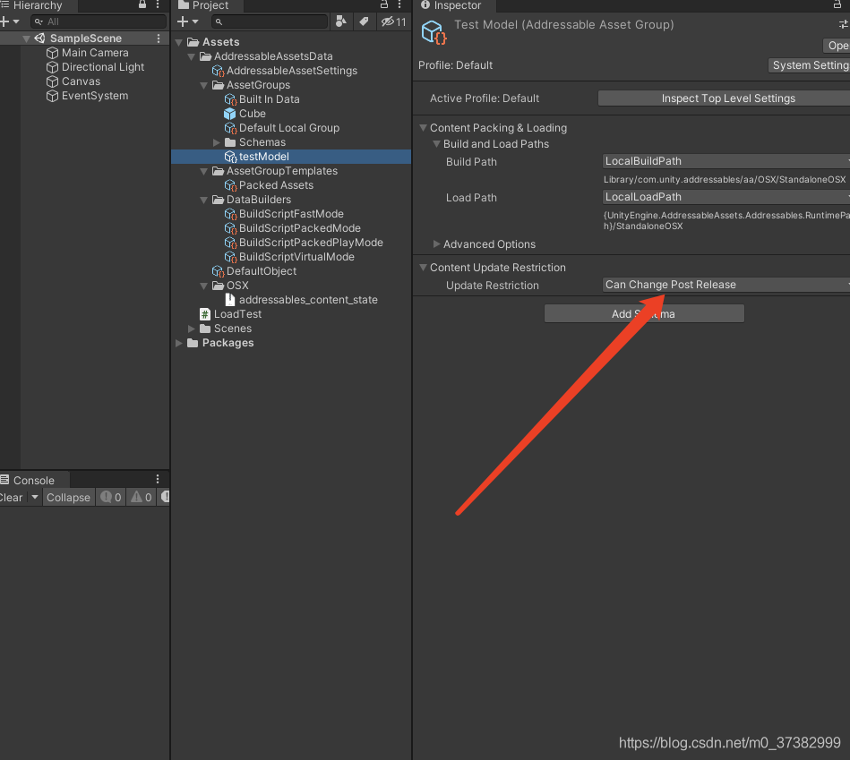
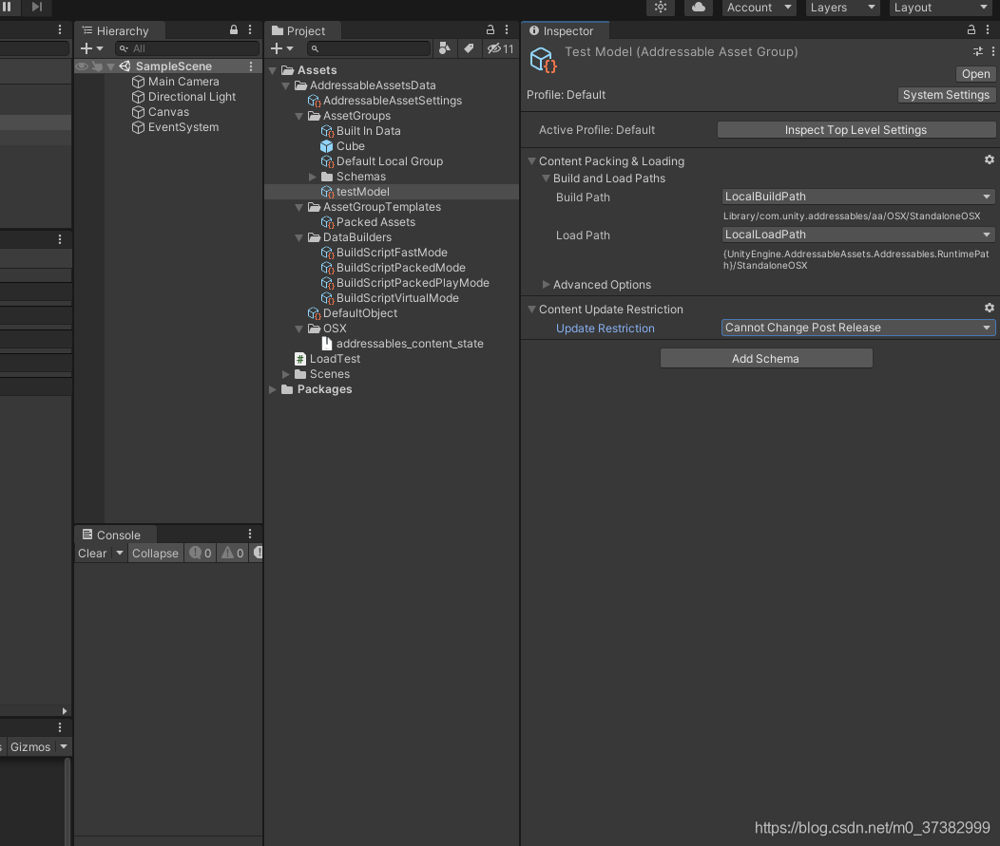
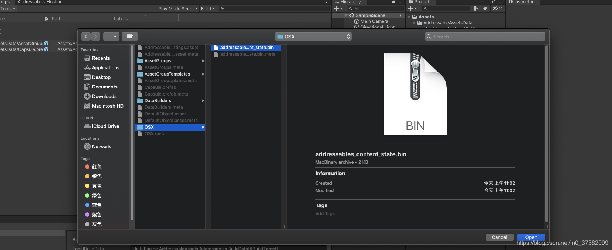
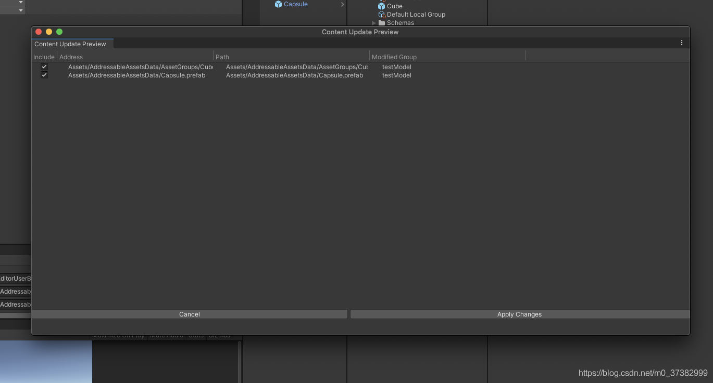
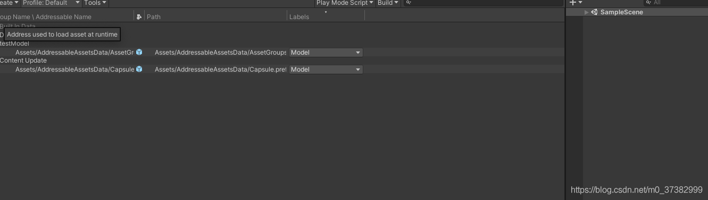
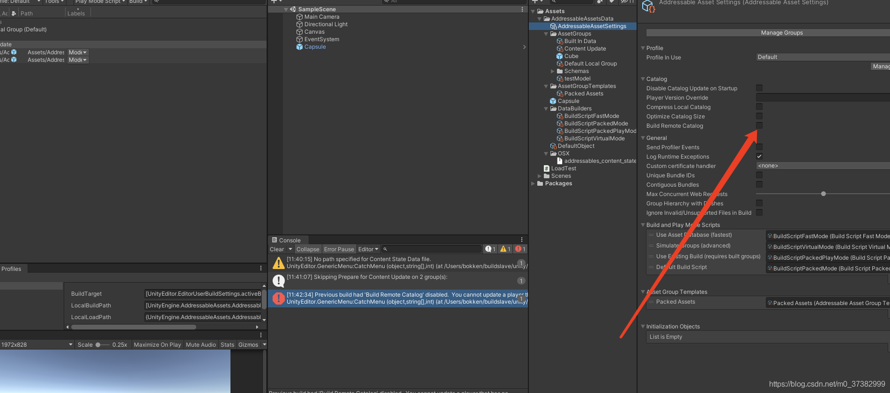
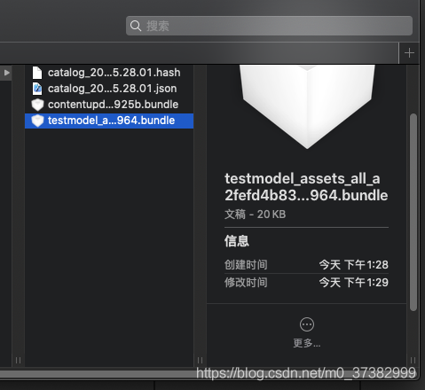
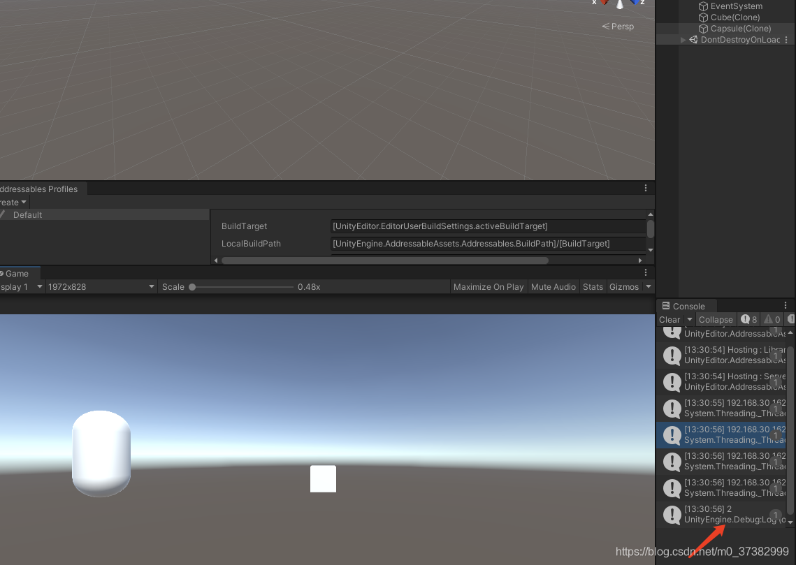

# Addressables增量更新

[CSDN个人文章] <https://blog.csdn.net/m0_37382999?type=blog>

# 上一篇的Addressables 入门尝试 [传送门](https://blog.csdn.net/m0_37382999/article/details/114361608?spm=1001.2014.3001.5502)

1.找到对应Groups的AssetsSetting 
 

默认是直接替换原始的包体，我们需要修改成Can Not Change

2.此时我们新加入一个资源并且点击Tools下=>Check for Content Update Restrictions
并且选择 Bin文件

Apply Changes

此时回多出来一个ContentUpdate 点击更新打包按钮。此时我发现了一个报错

应该是Setting设置需要打开BuildRemote calog这个选项

下面是打包完成后，我们的增量包

最后附上运行成功的截图
