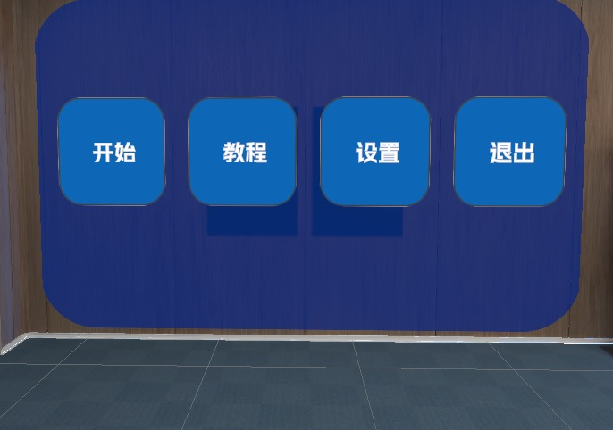
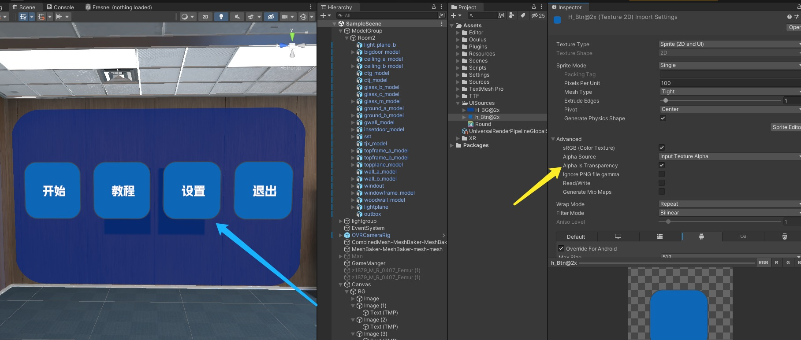

# Unity 常见Error问题 <Badge text="主题"/>

## Unity打包出现com.android.build.gradle.internal.tasks.workers$actionfacade
    
    这个是无意触发的一个Bug，应该跟Unity本身有关
    解决办法：BuildSetting=>Services=>Organizations  选择一下当前Unity的登陆账号再次打包就解决了

## Unity 圆角矩形UI边缘发白的解决办法
  
  

