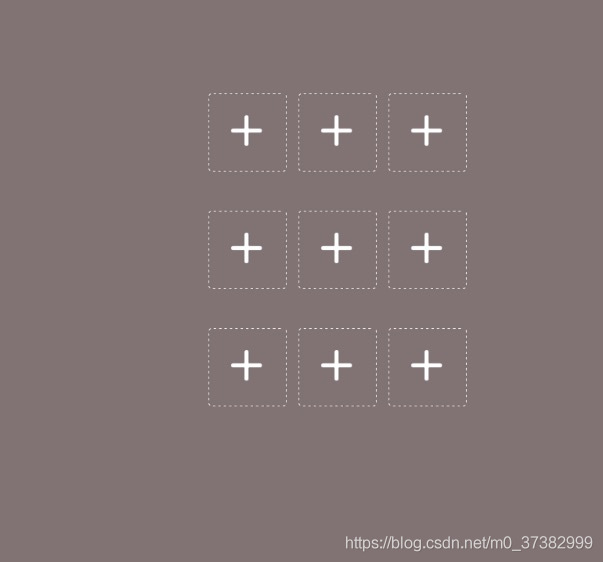
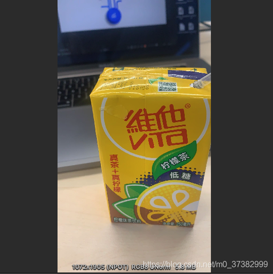
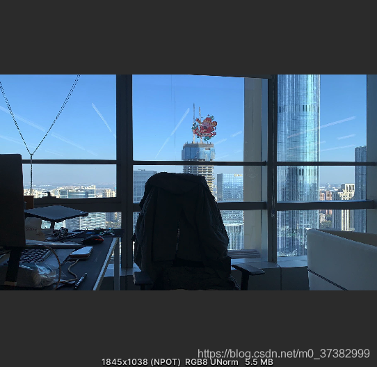
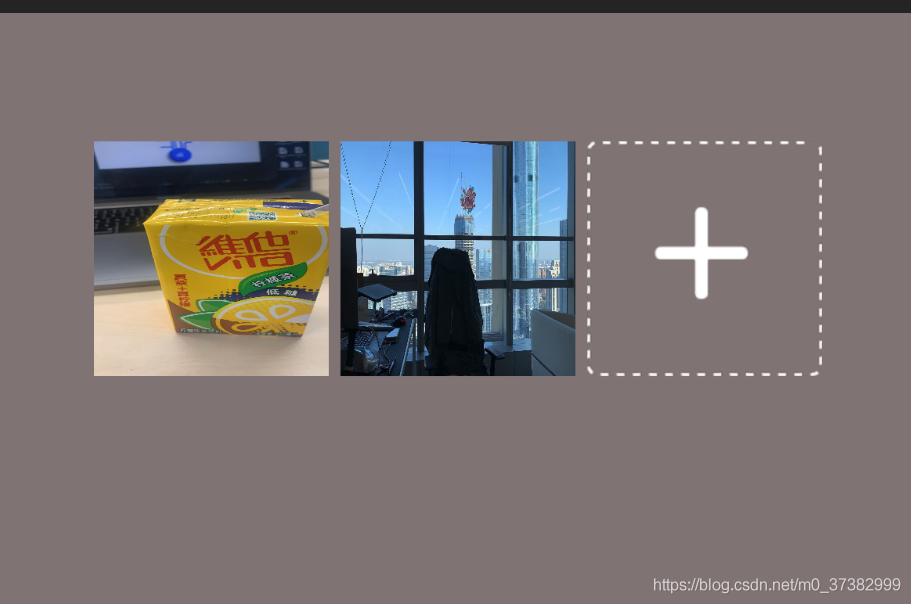
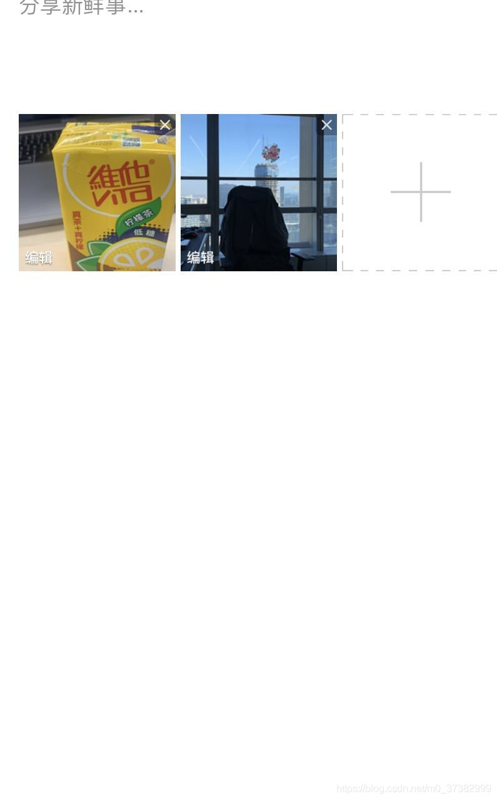
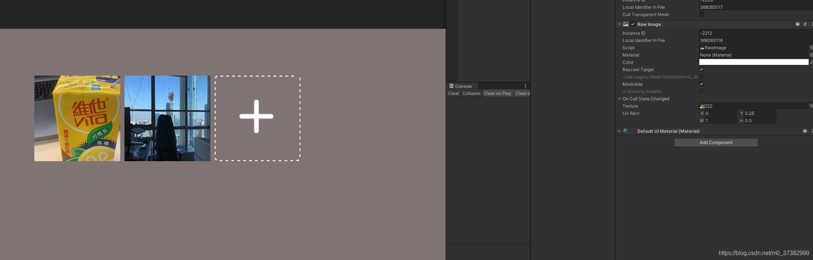
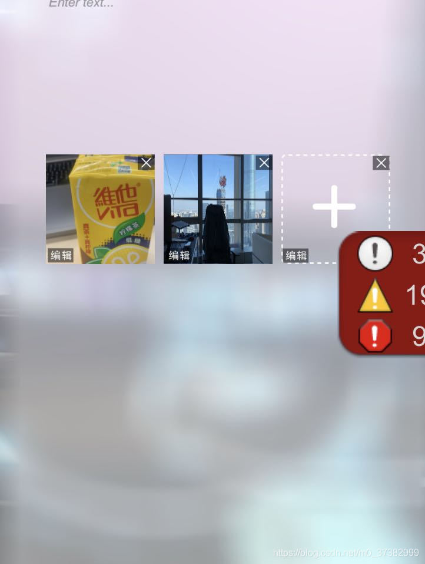

# 移动端的图片上传相关问题
    1.(Unity 移动端获取相册图片后，竖屏照片跟横屏照片的处理)
        >类似于微博上传图片的处理方式
    (1).我们先搭建一个类似9宫格的上传界面

    2.我们再从iPhone 导出两张照。照片一张为横屏拍摄，一张为竖屏拍摄

   
    3.很明显我们看到了一张1072*1905跟1845*1038的照片我们先不做处理直接将图片赋值给RawImage

    
    很明显竖屏的照片被拉伸后失真，我有过一篇文章用其他方式处理过这个问题
[跳转链接]<https://blog.csdn.net/m0_37382999/article/details/109443871>
    
    类似微博的处理方式
    1.微博的效果

    
    Unity处理
    调整RawImage 下的UVRect 值为 X:0  Y:0.25f W:1 H:0.5f
    我们来看下PC上的效果

    我们来看下移动端上的效果

    完美还原微博上传图片的效果的效果，这边多一句，微博点开可以放大图片，其实也就是RawImage 的SetNativeSize 的事件，我们如果想要实现点击查看大图，或者原图的效果。即可调用该方法。
