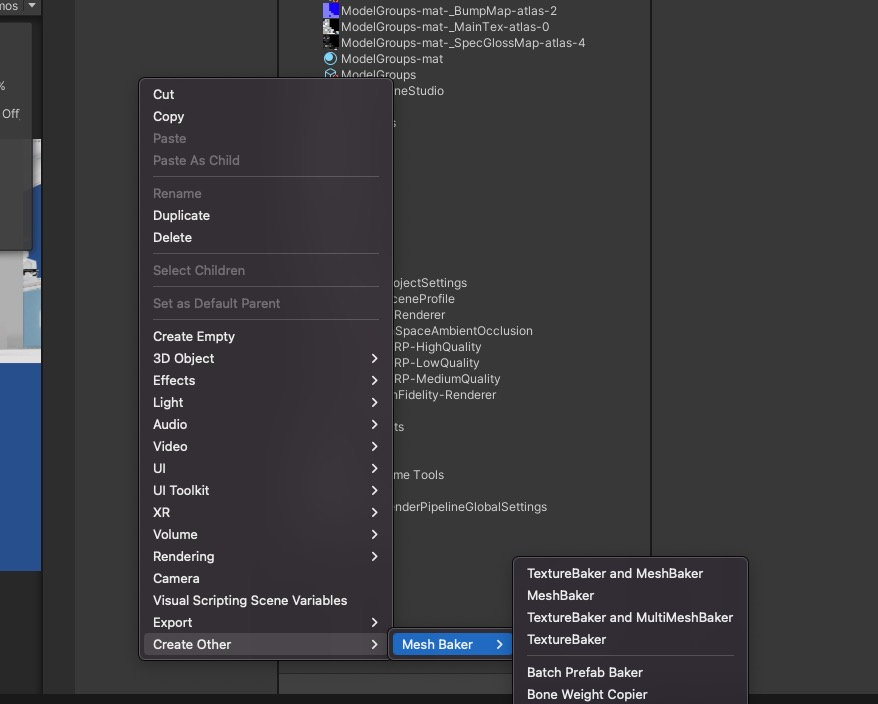
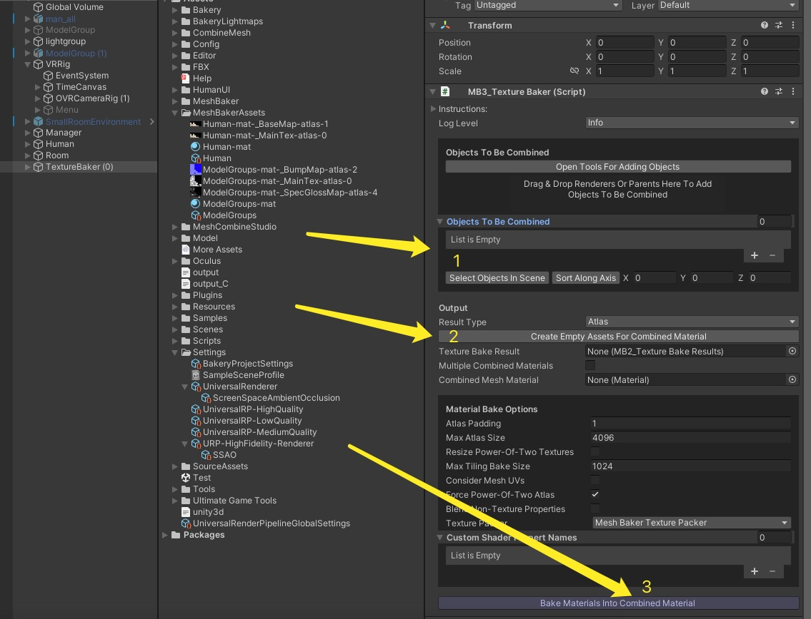
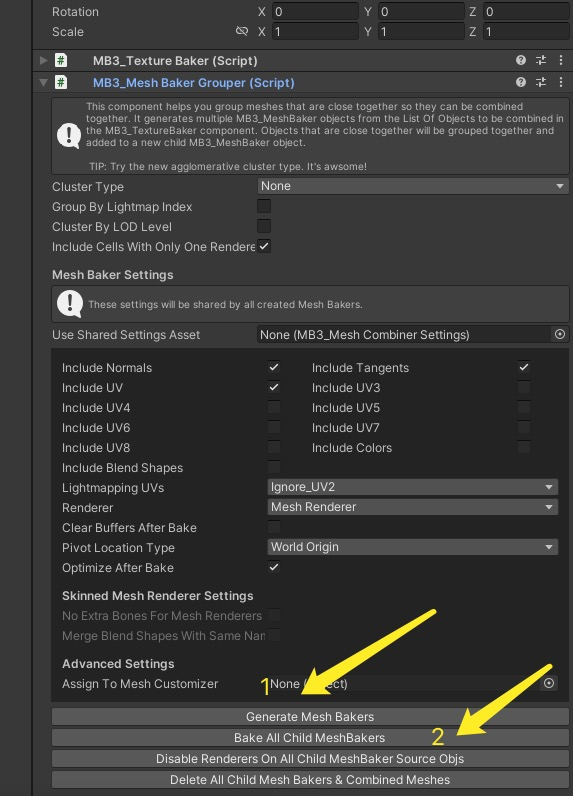
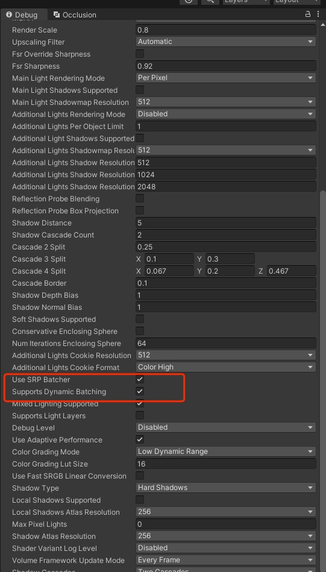

# 移动端的性能优化
 ## Mesh合并
     1.MeshBaker
[下载链接]<https://download.csdn.net/download/m0_37382999/16239204?spm=1001.2014.3001.5503> 
    
    (1)导入插件后创建一个TextureBakerAndMeshBaker对象(一般大多都是这个Baker Prefab对象)

    (2)这个Prefab有两个主要的脚本一个是Baker一个是Baker Groups，我们先来看Baker脚本
        按照一下步骤做一个基础的流程，具体的参数设置也很简单自己研究一下，由此步骤
        我们可以得到一个Texture的图集，一个标准的材质球，还有一个Mesh Baker关联M材质跟Texture关系的ScriptsObjectAssets

    （3）Baker Groups脚本如果没有特殊要求只需要按照两步就可以得到
        完成后我们发现新生成的对象，共同应用一个Texture的图集跟一个通用的材质球，帮助我们省去了Static Batching的很多限制因素
        完成后的模型，可以隐藏掉原始的模型，打开Static Batching你从Profiler中能够明显看到Static Batching的数量
  

 ## 材质球合并
    1.MeshCombineStudio
[下载链接]<https://download.csdn.net/download/m0_37382999/87663913> 
   
    2.MeshSimplify

    3.MeshBaker
[下载链接]<https://download.csdn.net/download/m0_37382999/16239204?spm=1001.2014.3001.5503> 

 ## UPR性能分析工具
 ## Xcode性能分析工具
 ## URP相关小问题
    1.有关Dynamic Batching 我在12.1.7的版本中未找到开关
    最后在UniversalRenderPipelineasset Debug的View下找到了对应的开关
    SPR Batching也一样

## 视频教程推荐

从头认真看完你会有很多的收获  

[视频链接]<https://www.bilibili.com/video/BV1AL4y1b75c/?spm_id_from=333.788>

 

   