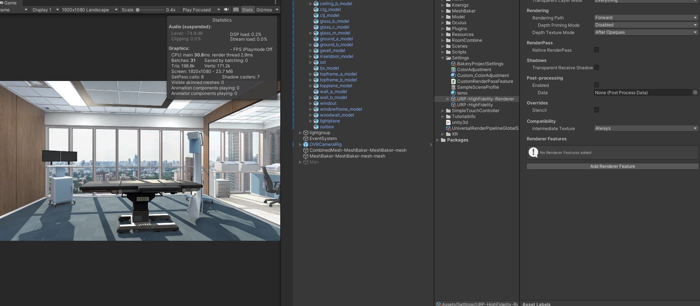
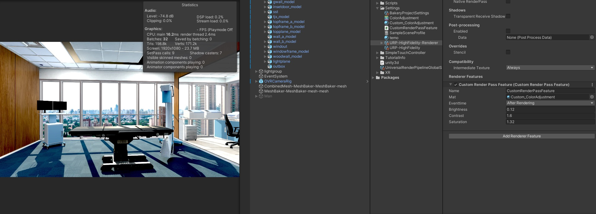

# URP Feature RenderPass 示例 <Badge text="URPv12.1.7"/>

## URPFeature Color Adjustment 自定义后处理效果
+ 代码如下（URP管线中Creat->Rendering->URP Render Feature）
+ + 下面我们来写一个色彩饱和度的例子相关的重要函数在函数中注明
``` csharp
using UnityEngine;
using UnityEngine.Rendering;
using UnityEngine.Rendering.Universal;

class CustomRenderPassFeature : ScriptableRendererFeature
{

    public Material Mat;
    public RenderPassEvent eventtime;
    
    public  float m_Brightness;
    public  float m_Contrast;
    public  float m_Saturation;
    
    //这里CustomRenderPass 如果修改需要跟Create函数与AddRenderPasses对应
    class CustomRenderPass : ScriptableRenderPass
    {
        
        private  float Brightness;
        private  float Contrast;
        private  float Saturation;
        
        static readonly int _MainTexString = Shader.PropertyToID("_MainColorTex");
        static readonly int _BrightnessString = Shader.PropertyToID("_Brightness");
        static readonly int _ContrastString = Shader.PropertyToID("_Contrast");
        static readonly int _SaturationString = Shader.PropertyToID("_Saturation");

        private Material tempmat;
        private RenderTargetIdentifier source;

        private RenderTargetIdentifier temptex = new RenderTargetIdentifier(_MainTexString);

        public void Setup(RenderTargetIdentifier source)
        {
            this.source = source;
        }

        public CustomRenderPass(Material mat,float v_1,float v_2,float v_3)
        {
            this.tempmat = mat;
            this.Brightness = v_1;
            this.Contrast = v_2;
            this.Saturation = v_3;
        }

        ///常常初始化的一些设置如材质的赋值，等一些操作，可以看作成mono中的OnEnable函数
        public override void OnCameraSetup(CommandBuffer cmd, ref RenderingData renderingData)
        {
        }

        ///主要的渲染函数，可以看作Update函数
        public override void Execute(ScriptableRenderContext context, ref RenderingData renderingData)
        {
            CommandBuffer cmd = CommandBufferPool.Get("CustomRenderPassFeature");

            RenderTextureDescriptor opaqueDesc = renderingData.cameraData.cameraTargetDescriptor;

            opaqueDesc.depthBufferBits = 0;

            //获取一份临时的图像数据
            cmd.GetTemporaryRT(_MainTexString, opaqueDesc, FilterMode.Bilinear);

            //拷贝到TempTex中
            cmd.CopyTexture(source, temptex);
            
            tempmat.SetFloat(_BrightnessString,Brightness);
            tempmat.SetFloat(_ContrastString,Contrast);
            tempmat.SetFloat(_SaturationString,Saturation);

            cmd.Blit(temptex, source, tempmat, 0);

            //提交命令到缓冲区
            context.ExecuteCommandBuffer(cmd);

            cmd.Release();
        }

        //可以看作成OnDisEnable函数，常常用于图像数据的释放，Dispose，Reseale()
        public override void OnCameraCleanup(CommandBuffer cmd)
        {
            cmd.ReleaseTemporaryRT(_MainTexString);
            cmd.ReleaseTemporaryRT(_BrightnessString);
            cmd.ReleaseTemporaryRT(_ContrastString);
            cmd.ReleaseTemporaryRT(_SaturationString);
        }
    }

    CustomRenderPass m_ScriptablePass;

    public override void Create()
    {
        //创建当前Pass
        m_ScriptablePass = new CustomRenderPass(Mat,m_Brightness,m_Contrast,m_Saturation);

        m_ScriptablePass.renderPassEvent =eventtime;
    }

    public override void AddRenderPasses(ScriptableRenderer renderer, ref RenderingData renderingData)
    {
        m_ScriptablePass.Setup(renderer.cameraColorTarget);
        renderer.EnqueuePass(m_ScriptablePass);
    }
}

```

``` csharp
Shader "Custom/ColorAdjustment"
{
    Properties
    {
        _MainTex ("Texture", 2D) = "white" {}
        _Brightness ("Brightness", Range(-1, 1)) = 0
        _Contrast ("Contrast", Range(0, 2)) = 1
        _Saturation ("Saturation", Range(0, 2)) = 1
    }

    SubShader
    {
        Tags { "RenderType"="Opaque" }

        Pass
        {
            CGPROGRAM
            #pragma vertex vert
            #pragma fragment frag

            #include "UnityCG.cginc"

            struct appdata
            {
                float4 vertex : POSITION;
                float2 uv : TEXCOORD0;
            };

            struct v2f
            {
                float2 uv : TEXCOORD0;
                float4 vertex : SV_POSITION;
            };

            sampler2D _MainTex;
            float _Brightness;
            float _Contrast;
            float _Saturation;

            v2f vert (appdata v)
            {
                v2f o;
                o.vertex = UnityObjectToClipPos(v.vertex);
                o.uv = v.uv;
                return o;
            }

            float4 frag (v2f i) : SV_Target
            {
                float4 col = tex2D(_MainTex, i.uv);

                // Brightness adjustment
                col.rgb += _Brightness;

                // Contrast adjustment
                col.rgb = (col.rgb - 0.5) * _Contrast + 0.5;

                // Saturation adjustment
                float lum = dot(col.rgb, float3(0.2126, 0.7152, 0.0722));
                col.rgb = lerp(float3(lum, lum, lum), col.rgb, _Saturation);

                return col;
            }
            ENDCG
        }
    }
    FallBack "Diffuse"
}

```

    效果如下图





<font color="#0000dd">TODO:
最初的出发点是因为Oculus Q2中对后处理的性能代价太大，想要自己剥离开Postprcessing中亢余的渲染，但是目前这个Feature在VR中无法渲染到VR相机上，具体的原因还未找到，--！</font><br /> 