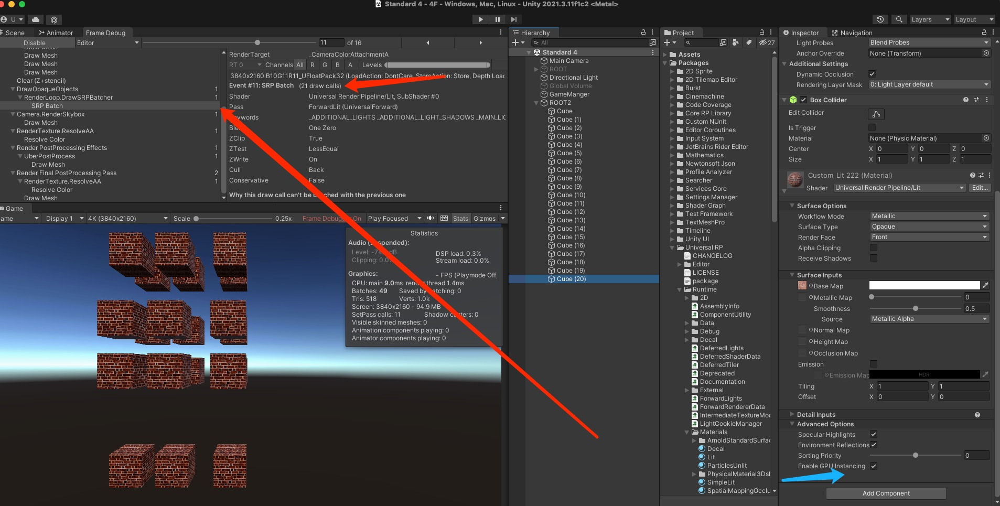
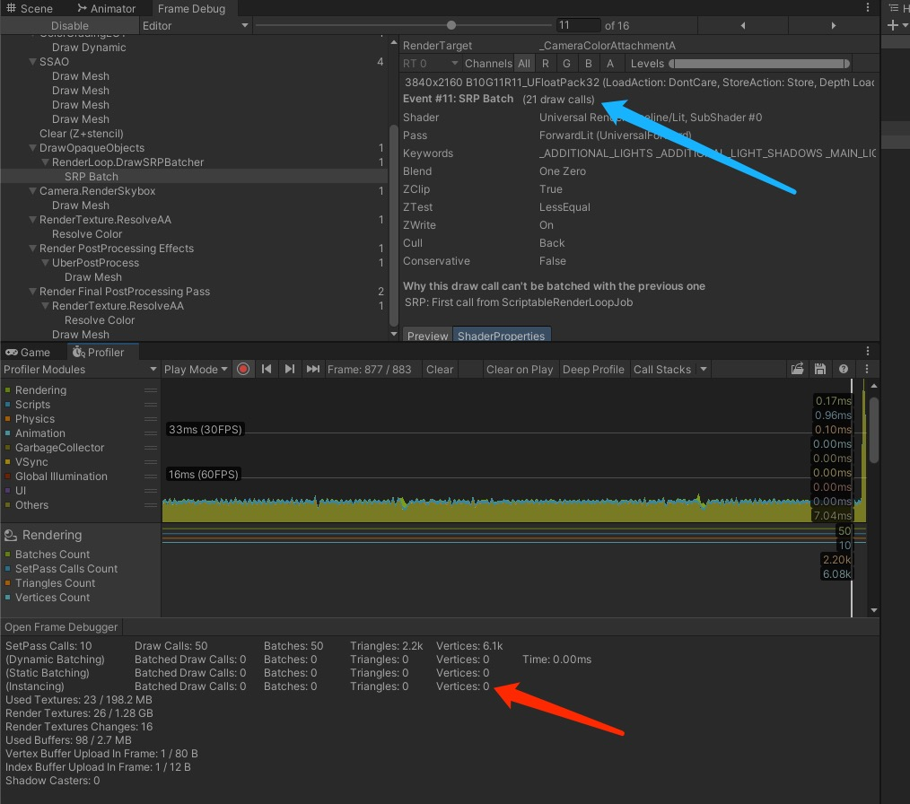
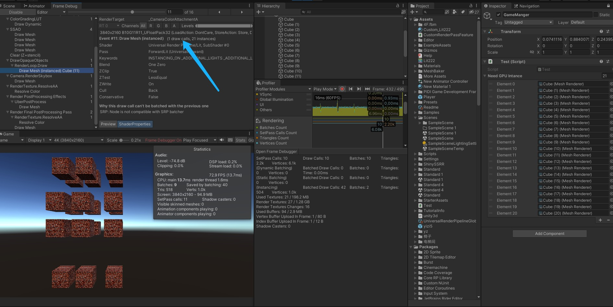
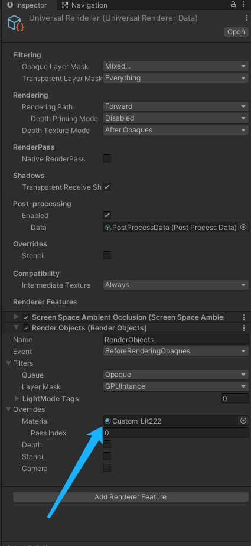

# URP 中SRP跟GPU Instancing相关问题
+ 在URP中SRP默认是打开的，URP中SRP优先于GPUInstancing 所以常常我们在URP中需要GPU Instancing的物体会不成功,如下图



+ +  此时我们的发现GPU Instancing是没有成功的是因为SRP优先级最高，但是SRP并不能帮我们将DrawCalls降下来，从Frame Debugger看，Draw Call 还是21个，此时要么考虑Static batching合并，这样又会造成打包后Unity的编译包体变大，接下来我们介绍一下如何在URP中打断一些物体我们不想要SRP合批的方法，或者别的工具Mesh Baker提前将这些东西合并成一个Mesh，下面只是单纯介绍Unity里面的简单一种做法。（不通过Shader跟Unity RenderFeafure的做法）



## 通过MaterialPropertyBlock（都知道MaterialPropertyBlock可以打断SRP具体如何操作呢）
``` csharp

//需要GPUInstancing 合批的方法
 public List<MeshRenderer> m_NeedGPUIntance = new List<MeshRenderer>();

    private void Awake()
    {
        MaterialPropertyBlock materialPropertyBlock = new MaterialPropertyBlock();
        for (int i = 0; i < m_NeedGPUIntance.Count; i++)
        {
            //这里我修改颜色，其实也可以Set其他的Property
            materialPropertyBlock.SetColor("_Color", Color.white);
            m_NeedGPUIntance[i].SetPropertyBlock(materialPropertyBlock);
        }
    }
```
+ 我们再来看一下Frame Debug及Profiler（这边为啥是48个Draw Calls21个Cube不应该21个吗是因为我打开了SSAO，关闭就是正确了的SSAO又计算了一遍Cube）
+ 此时我们就打断了SRP的合批，将指定的物体进行了GPUInstancing处理


## 通过URP的RenderFeature 处理
+ 这个可以自己写RenderPass ，获取指定层级下的所有需要合批的Mesh，然后再进行打断SRP进行GPUInstancing处理
+ 我这边就用的RenderObjects 介绍一下
+ + LayMask 是用来区分需要处理的层级物体，将需要SRP ，Static Batching ，GPUInstancing的物体分别渲染区分 
+ + Event 是执行的事件，这边是渲染不透明物体之前，自定义
+ + Overrides 中就是可以替换的Mat，这边可以使用自定shader 来选择是否支持SRP及GpuInstancing



