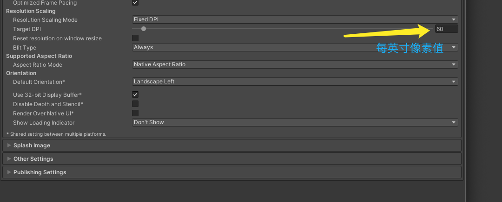
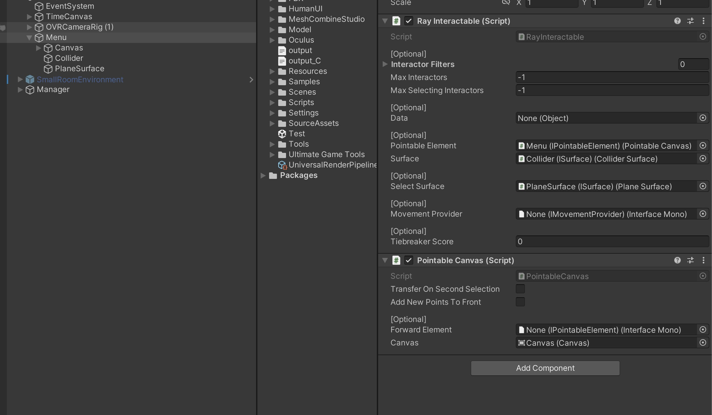

# Oculus <Badge text="Oculus主题"/>
## 有关VR一体机的抗锯齿一些设置 <Badge text="抗锯齿" type="warning"/>
    下面是相关设置
  

    1.如果是URP渲染管线下，请关闭Allow DynamicResolution，并且设置DPI的每英寸的像素点如上图
    2.请对应使用合适的抗锯齿算法如MSAA FXAA SMAA
    3.UI的字体使用TextPro
    4.修改RenderScale 的值（默认是1，注意URP渲染管线下在universal render pipeline asset中设置）
    5.使用MeshBaker工具将物体合并纹理Mesh合并，不动的物体走静态，带动画及移动的物体看项目需求走Dynamic Bactching.(带动画的Mesh Baker合并注意使用SkinMeshRender)

 以上的方法均有性能的开销，请根据个人的项目调整合适的数值

 ## 有关Oculus Quest中实测V47 Oculus intergration所遇到的一些问题总结 <Badge text="Oculus intergration v47" type="warning"/>

* UI射线触发大致流程
    (1)EventSystem 需要挂在CanvasModule
    (2)Cavas挂在在一个空物体的下方，该物体挂在RayInteractable脚本及Pointable Canvas
    (3)Canvas 同级创建两个空物体一个Collider，一个PlaneSurface,注意的是Collider挂在colliderSurface及BoxCollider,注意使用EditCollider调整碰撞器的大小与Canvas一致，PalneSurface只需要挂载PlaneSurface就行

        下面是引用关系图
  

## Oculus 安装官方Metric Tools性能分析工具
  + Mac版配置ADB(自行去官网下载Metric Tools APK)
+ + 1.echo $HOME（进入当前用户home目录）
+ +  2.touch .bash_profile（创建.bash_profile文件）
+ + 3.open -e .bash_profile（打开.bash_profile文件）
+ + 4.export PATH=${PATH}:你电脑sdk的路径/tools:你电脑sdk的路径platform-tools（编辑打开的.bash_profile文件，这里我是使用了UnityHub下AndroidSDK的tool跟platform-tools）
+ + 5.source .bash_profile
+ + 6.adb version(检测是否配置成功)
+ + 7.adb install XXXXX(Metric Tools Mac端APK路径)
